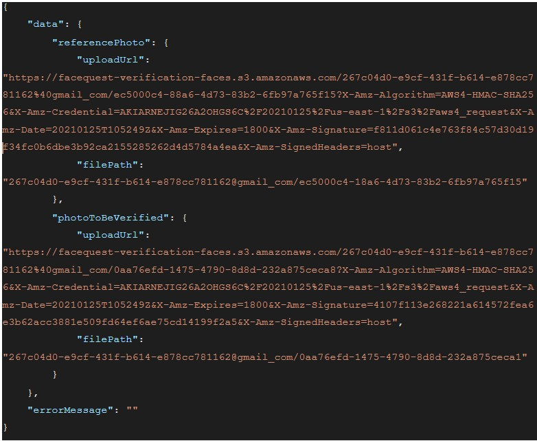

## Facequest API Tutorial:
 

Facequest is facial recognition software as a service. That also provides an API (Application Programming Interface) for interacting with your client easily. 

You do not need jazzy infra or AI coding skills to recognize faces in your software. FaceQuest® enables you to concentrate on building your own software, without additional investment and maintenance for high end infrastructure.

FaceQuest® does not care what programming language you use to code. As long as you can call HTTP(s) API end-points from your code, you could recognize faces from Java, JavaScript, Ruby, Scala.

[For more details visit our API Docs here](https://facequest.io/api-docs)

If you want to integrate an API backend using Node.js and Java, we have created a sample client in github repository for Node.js and Java.

[Node.js Client](https://github.com/facequest/sample-nodejs-client)

[Java Client](https://github.com/facequest/sample-spring-boot-client)

We need some basic credentials for authentication of our API’s.

### Authentication:

 
<b>Email:</b> We require an email registered with Facequest.io

<b>Secret:</b> Facequest API secret key that you have set from Facequest web UI

<b>Constant-Authorization-Token:</b> A constant “bearer” required for all requests via API.

To call API endpoints we have used Postman or you can use a terminal or command prompt and make a curl request as per examples given in the api documentation page.

 

### Face Verifications through API’s:
 
APIs for FaceQuest's 1:1 Face verification.

Here step by step guide is given for how to do face verification, get verification logs, track verification results through verification ID, fetch photo upload URL and file path of the photo to be verified through facequest API.
To create a face verification request through API, First we need to have the file path of the photo to be uploaded for face verification, one is reference face file path and other is photo to be verified file path. We use this file path in request we have to post from our terminal to facequest API endpoint.

We are using Postman to make all requests to the API endpoint.

<b>How to make curl requests through Postman?</b>

1. 1) Open POSTMAN.
2. 2) Click on the <b>"import"</b> tab on the upper left side.
3. 3) Select the Raw Text option and paste your cURL command.
4. 4) Hit import and you will have the command in your Postman builder.
5. 5) Click Send to post the command.

 

#### Step 1:

#### Fetch Upload URLs:

 

Returns pre-signed URLs to upload reference photo and the photo to be verified.
For the authentication we use <b>email Id, secret token and constant authorization token “bearer”</b>.

*Here is the sample request to get upload URLs.*

* curl -X GET 'https://verifyapi.facequest.io/api/v1/verification/uploadurl' \
* -H 'secret: secret_that_i_set_in_facequest_web_ui' \
* -H 'email: email_id_registered_with_facequest' \
* -H 'accept: application/json' \
* -H 'authorizationtoken: bearer' \
* --compressed

 

*Example: Fetch upload URL*

In this example we make curl requests through a Postman client that returns us a reference face *“upload URL”* and  *“file path”* and photo to be verified *“upload URL”* and  *“file path”*. 

This url and file path are used to create face verification request through API. We need to pass the file path that is given in this response when creating a face verification request.

 

#### Step 2:

#### How to Upload ReferencePhoto and Photo to Be Verified?

 

To upload photos on which we have to do face verification, first we need to upload it via our API endpoint. We already have an upload URL of photos that’s fetched from the above API endpoint response like this example.
 

*Example: API Response*

Here we have upload URL and file path of reference photo and photo to be verified. This url is useful for uploading reference photo and photo to be verified.

 

*Example: Upload Photo*

 

In the above given example we have to upload both reference photo and photo to be verified via PUT request through postman. Just copy the reference photo upload URL, create a PUT request and paste the URL that we copied earlier. Also we have to send an image file(Reference Photo or Photo to be verified ) with this request. 

1. 1) Go to Body in postman, then click form-data.
2. 2) Then you have to see Key and Value columns there.
3. 3) In the key there is an option to select “text or File”. Give any name you like as a key.
4. 4) In the value column you see the “select files” option. Here you have to select a reference photo from your computer’s local storage.
5. 5) Then press the “send” button. You will see the status message “200 OK”, meaning your photo is successfully uploaded.

 
Repeat the same process for “photo to be verified”. Just copy “Photo to be verified” URL and select file then create a new PUT request with it to upload the photo.

 

#### Step 3:
#### Create Verification Request:

 
Creates a new verification request with/without using the stored reference photo from folders. The progress of this request can be tracked asynchronously.

We just have to pass a reference photo file path and photo to be verified file path to create this request. We can copy file path response from the fetch upload URL endpoint.

*For example:*

* curl -X POST 'https://verifyapi.facequest.io/api/v1/verification' \
* -H 'secret: secret_that_i_set_in_facequest_web_ui' \
* -H 'email: email_id_registered_with_facequest' \
* -H 'accept: application/json' \
* -H 'authorizationtoken: bearer' \
* --compressed

 

<b>Payload to be passed with the request:</b> We have to pass the payload given below with the value of tile, notes, referencePhotoFilePath, photoToBeVerifiedFilePath, and useStoredPhotoForReference. 

{
  * "title": "verify photo sample",
  * "notes": "sample notes",
  * "referencePhotoFilePath": "String",
  * "photoToBeVerifiedFilePath": "String",
  * "useStoredPhotoForReference": "false"
  

}

If you want to use a stored photo for reference then you just need to pass the true value in <b>*"useStoredPhotoForReference"*</b> otherwise pass false.
See this example given below to create a verification request from API. This returns the <b>*“Verification Request Id”*</b> back.

 

*Example: Create verifiation request*

 

#### Step 4:
#### Track verification Request:

 
Track any verification request using verificationRequestId, returned upon invoking POST request at URL /api/v1/verification.

For the verification we just need to pass Verification Request Id to the api endpoint that we copied from the “create verification request” response.

*Sample Request:*

* curl -X GET 'https://verifyapi.facequest.io/api/v1/verification/{verificationRequestId}' \
* -H 'secret: secret_that_i_set_in_facequest_web_ui' \
* -H 'email: email_id_registered_with_facequest' \
* -H 'accept: application/json' \
* -H 'authorizationtoken: bearer' \
* --compressed

 

*Example: Track verifiation request*

 
This gives us the verification result back with matched percentage, title and notes.

 

#### Step 5:
#### Fetch Verification Logs: 

 
To fetch face verification logs that you have done earlier, you only need to get data from the API endpoint as per given example.

Just paste this command in the terminal or make a curl request using Postman, that gives us all verification logs data in JSON format.

*Sample CURL request:*

* curl -X GET 'https://verifyapi.facequest.io/api/v1/verification/logs' \
* -H 'secret: secret_that_i_set_in_facequest_web_ui' \
* -H 'email: email_id_registered_with_facequest' \
* -H 'accept: application/json' \
* -H 'authorizationtoken: bearer' \
* --compressed

 
You just have to add your Facequest login email Id and Secret token that you have set from the Facequest UI dashboard.

 

*Example: Fetch verifiation logs*

 

In this curl request we passed email, secret and constant authorization token “bearer” in our case. In the example given below we make GET request for all verification logs through Postman.

If there is no data to show it will return an empty object back with status code 200.
In case of unauthorized request it returns an <b>“unauthorized”</b> error message with status code 401.