## Face verification Tutorial using UI

 

### How to perform Facial Recognition (1:1 Face Match)?

 
FaceQuest® 1:1 Facial Recognition Technology can be used to verify the photo of a person with the photo on their ID
document. Capture the face image of the partner or customer and easily match the face
with the one present in their ID. Save a significant amount on manual verification procedures.

Here in this example we have performed facial recognition by manually uploading photos.

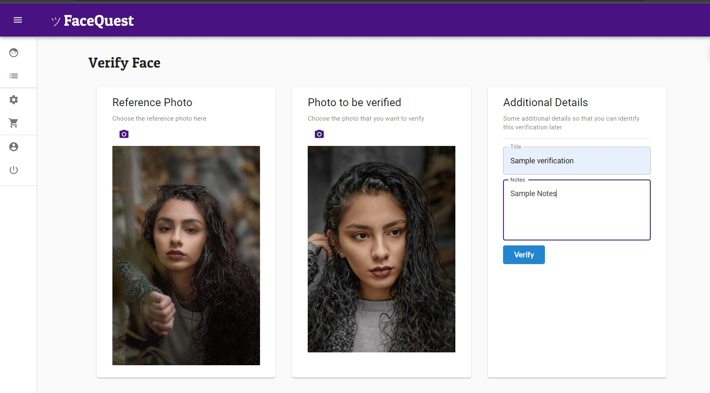
*Example: Face verifiaction by manually uploading photo*

 

#### Steps to performe face verification:
 
1. You just have to upload a reference photo by clicking on the camera icon from your device's local storage.
2. In photo to be verified you have to upload a photo that is to be verified with the first one.
3. In additional details you can add Title (optional) and Notes (optional) details so that you can identify this verification later.
4. Click the verify button to submit a request.

This will return the result of your face match in percentage(%). For example “Verification success! Match 87%”
 
 

### How to upload photo in FaceQuest® cloud by creating folders?
 
In this section we have to upload reference photo to the facequest cloud bucket by creating folders. 
User having cloud storage plan can user this functionality, so that you do not need to manually upload 
reference photo every time. Just upload once and use anytime from cloud.

From the menu go to the Reference faces tab there you will see the folder section for creating new folders. (This feature is available in cloud storage plan)
Type the name of the folder and click on the create button to create a new folder.

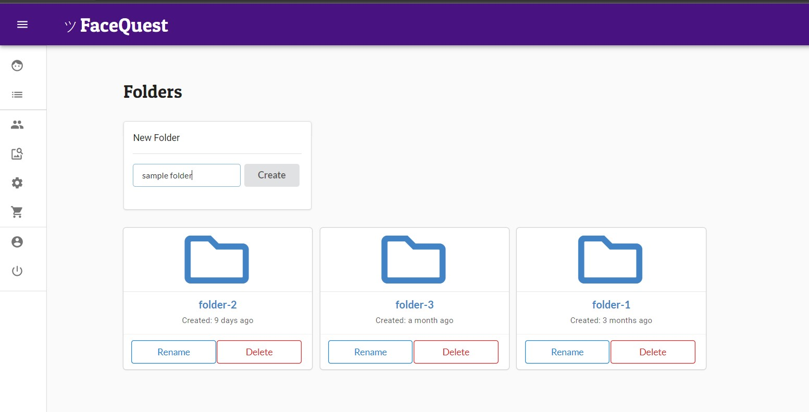
*Example: Create a folder*

 

#### How to upload photo in folder?

To upload a photo click on the folder icon, a new window will open there where you can upload photos in particular folders.

In this window you see an input box where you can enter the name of the photo to upload and then click on <b>“Attach
Photo”</b> button to select the photo from your device's local storage. This upload photo in this folder. There is a
success message appeared at the top right corner of the website that shows <b>“Reference Face created successfully”</b>.
You can see it anytime.
 
If you want to rename, delete or replace this photo that you have uploaded. There is a replace and delete button
given below the image. By clicking it you are able to replace, rename or delete photos.

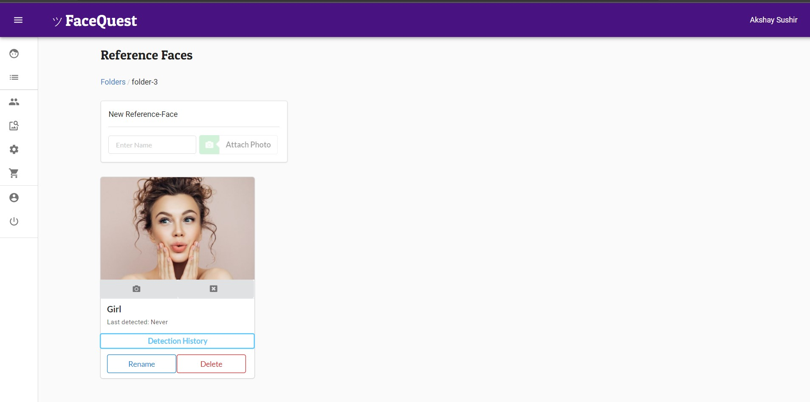
*Example: Upload photo in folder*

 
### How to Perform Face Verification with Cloud Storage (1:N Face Match)?
 
In the previous tutorial you have created a folder and uploaded a photo in it. To verify faces we have two options (1:1 Face match) which we have discussed at starting, you can manually upload photos. Here in 1:N Face Match we don’t have to upload Reference Photo manually. We can directly select one from folders that we have uploaded earlier in the reference faces section.

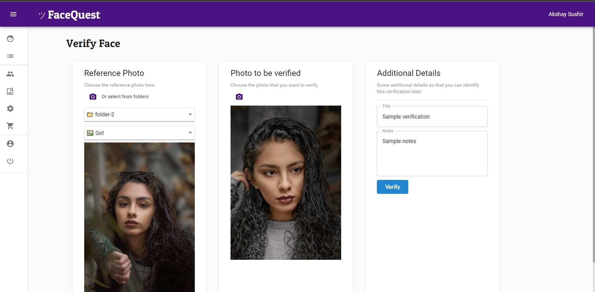

*Note: If you have a plan that has cloud storage available you can use this feature.*

In the above picture you can see two drop down menus, one for select folder and other one for select photo from folder that you have selected. After selecting the folder name and photo you can see the selected photo in “Reference Photo” section.

Now, you just have to upload the photo in the “Photo to be verified” section by clicking the camera icon. Then there is an option for add notes and title for this verification, so you can identify this verification later. Although it is optional, it is better to add some notes for face verification.

 

*Example: Verifiaction-result*

 
Then you have to click the “Verify” button to perform a face match, then after you can see the result of your face match (given in %). You see a message like in the picture below.

If both photos are of similar people you can see success messages with % match between two photos.

You encounter an error message if something went wrong or if you have to match two different people's faces. If faces are different or don't look alike then you see a message like “Faces does not look alike. Flag this for human review.”

That’s it you have successfully matched faces and get the result of verification. It is an easy to use platform for facial recognition or face match.

 
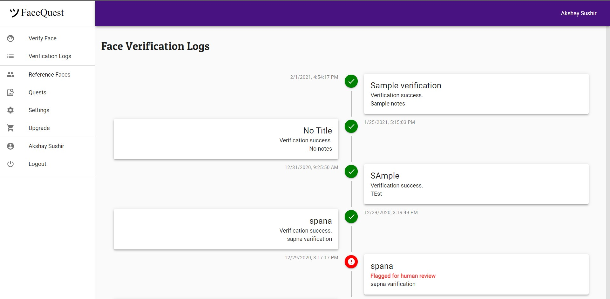
*Example: Verifiaction Logs*

 
You can see your all verification records in the Face verification Logs section like this. Where verification logs are given with title, notes and time stamp.

 

### How to do face search using Quests?

 
To perform verification using Quest you just have to select the folder name from dropdown menus. By clicking on the green camera icon you can upload photo that you have to match with your saved photos in your Database.

After you have selected your photo from your device’s local storage, you see the success message like “Quest is started successfully”. After some time you see the result in the status section given in this picture with a timestamp, detected faces etc.

 
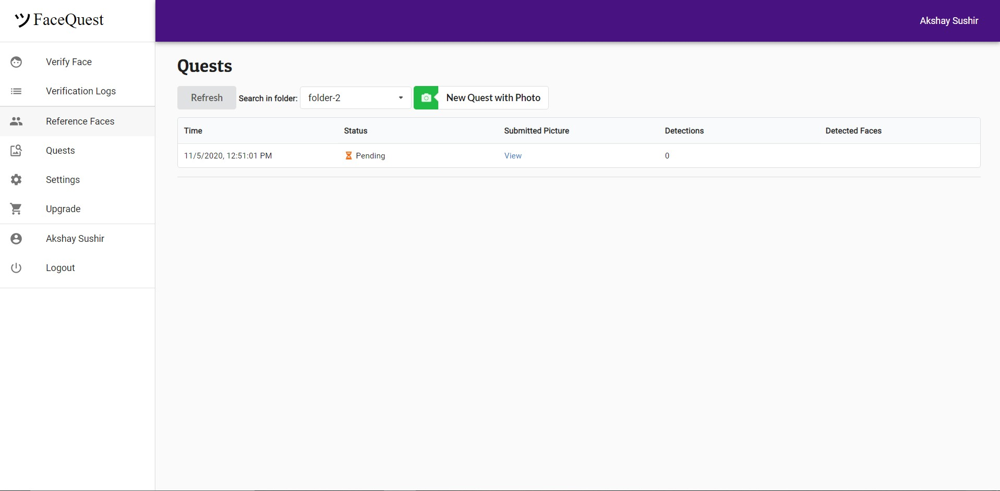
*Example: Face search using quest (Cloud image search)*

 

### Account Setting

 
In this section you have to see all your account information, remaining credits, reference faces and remaining transections. See this example given below.

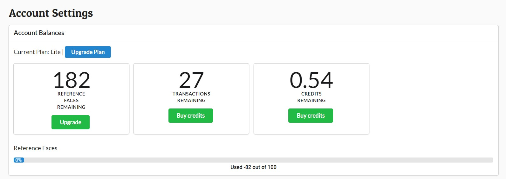
*Example: Account Balance Details*

#### Purchase Credits:

 
You can purchase credit also form this section by providing payment information. You can buy credits using a Debit card, Credit card, or UPI. By clicking the Pay button payment popup appeared.

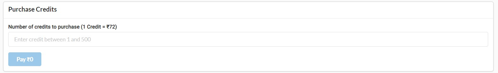
*Example: Purchase Credits*

You can purchase credits between 1 to 500 (max). Each credit costs 1$ or 72 indian rupees.

 

#### Setting up Secret Key:

 
If you are using API’s of Facequest you need to set an API secret for secure access of your API. You can set secret in Reset API Secret section. Don’t forget to remember this secret key, once you have set this secret key you can’t see this key.

 
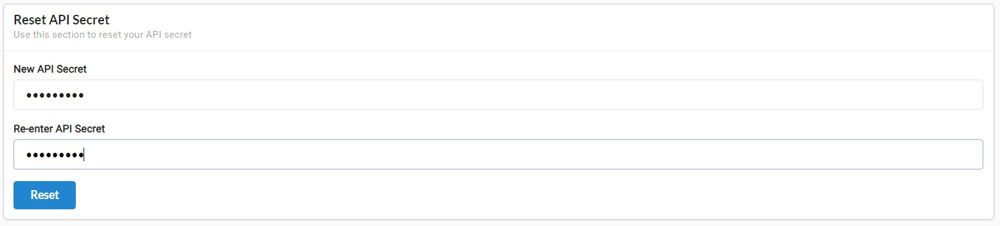
*Example: Reset API secret*

 

#### Setting up Billing Details:

 
You can add your billing details in this section like company name, address if your company, GST Number (Applicable to indian consumers only).

 
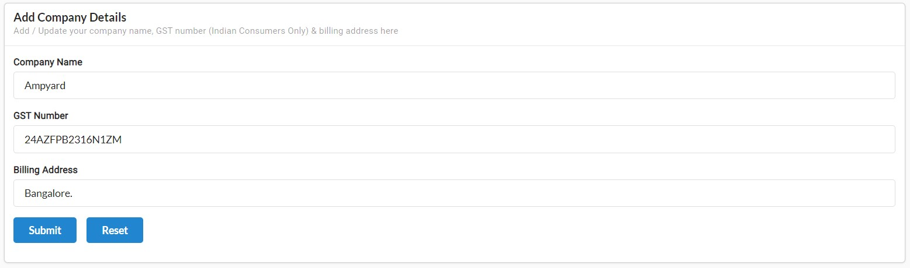
*Example: Set billing details*

 

#### How to upgrade your plan?

 
In the upgrade section you can see different plans and you can upgrade to any plan that is suitable for you. There are various plans like lite, pro and business for monthly and yearly plans

 
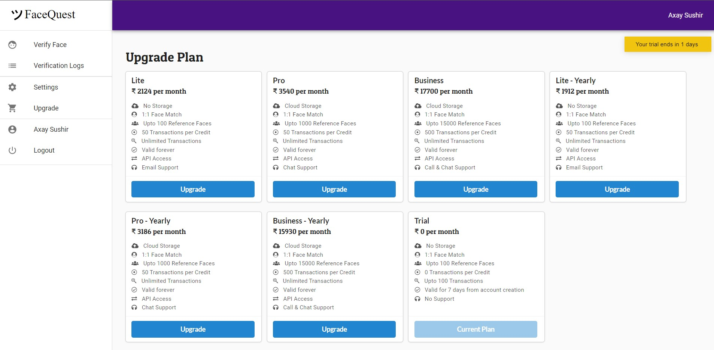
*Example: Upgrade Plan*

 
To upgrade to any plan just click the upgrade button and payment popup will be open where you can enter your credit and debit card details or pay through UPI.

 

#### User Profile Section:

 
To see all user information just click on user profile page where all user information is given like <b>username, emailId, phone number, company details </b> etc.

 
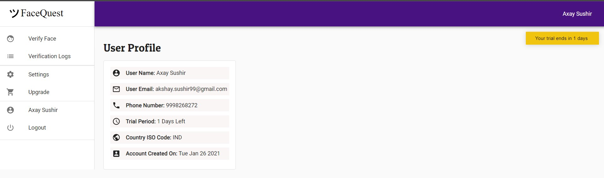
*Example: User Profile*
